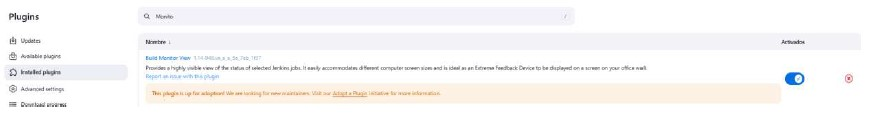
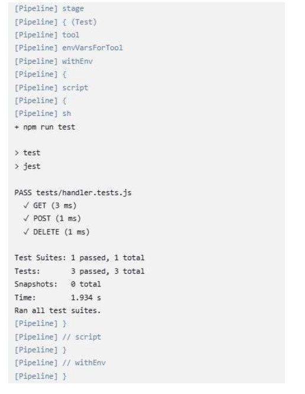
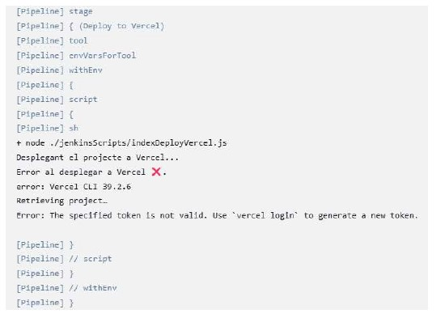

Example of nextjs project using Cypress.io

<!---Start place for the badge -->

<!---End place for the badge -->

## ¿Qué es Jenkins?

Jenkins es una herramienta de automatización de código abierto que se utiliza principalmente para la integración continua y entrega continua (CI/CD). Proporciona una plataforma flexible y extensible para compilar, probar y desplegar software automáticamente. 

### Características principales de Jenkins:
1. **Integración Continua (CI):** Ayuda a detectar errores temprano al integrar código de manera frecuente.
2. **Entrega Continua (CD):** Automatiza la preparación y despliegue de aplicaciones en entornos de producción.
3. **Extensibilidad:** Dispone de una amplia variedad de plugins para personalizar y adaptar a diferentes necesidades.
4. **Compatibilidad:** Funciona con múltiples sistemas operativos, lenguajes de programación y sistemas de control de versiones como Git.

### Ventajas de Jenkins:
- **Automatización:** Reduce el esfuerzo manual en el proceso de desarrollo y despliegue.
- **Monitoreo:** Ofrece reportes detallados del estado de las construcciones y las pruebas.
- **Comunidad Activa:** Dispone de una amplia comunidad que contribuye con plugins, soporte y mejoras constantes.

Para más información, visita el sitio oficial de Jenkins: [https://www.jenkins.io](https://www.jenkins.io)

---

## Pràctica Jenkins

**LINK DE VERCEL:** [https://practica-obligatoria-jenkins.vercel.app/](https://practica-obligatoria-jenkins.vercel.app/)  
**LINK DE GITHUB:** [https://github.com/Thor22Greta/practica_obligatoria_jenkins](https://github.com/Thor22Greta/practica_obligatoria_jenkins)  

Utilitzaré com a projecte base de React el repositori [https://github.com/antoni-gimenez/nodejs-blog-practica](https://github.com/antoni-gimenez/nodejs-blog-practica).  
Clone el repositori, accedisc a ell i el copie al nou repositori creat al meu GitHub: [https://github.com/Thor22Greta/practica_obligatoria_jenkins](https://github.com/Thor22Greta/practica_obligatoria_jenkins).  
  

He tingut problemes amb Jenkins, per tant l’he eliminat i tornat a descarregar. He fet les instal·lacions del pluggins necesaris (NodeJS, Ant, Monitor Build View).  
  

### CREACIÓ DE UNA PIPELINE A JENKINS:
Seleccionem “Nueva Tarea”, afegim un nom a la tasca i elegim l’opcio “Pipeline”:  
  
  

Necessitem passar uns parámetres a la nostra tasca. Cliquem a l’opció “Esta ejecución debe parametrizarse”, ”Añadir un parámetro” i seleccionarem “Parámetros de cadena” (son cadenes de text).  
  

Configurarem els paràmetres que nosaltres dessitjem:  
  

Vincule la Pipeline amb el repositori de Github, afegint els credencials i les branques del meu projecte:  
  

### CREACIÓ DE LA BRANCA `ci_jenkins` I DEL `Jenkinsfile`
Clone el repositori [https://github.com/Thor22Greta/practica_obligatoria_jenkins.git](https://github.com/Thor22Greta/practica_obligatoria_jenkins.git), cree la nova branca `ci_jenkins` i l’arxiu `Jenkinsfile`.  

1. **Petició de Dades:**  
Serà necessari utilitzar paràmetres:  
  

Haurem d’afegir un stage que gestione les dades que introduirem per paràmetres:  
  

El resultat una vegada corre la nostra Pipeline es:  
  

2. **STAGE DEL LINTER:**  
El linter revisa el nostre codi fent complir unes regles estandaritzades:  
  

Cree un script per a fer mes visual els resultats de Linter. La idea me la fa arribar el company Kike Valero:  
  

La execució de la part de Linter donarà este resultat a la Consola de la Pipeline:  
  

3. **STAGE DELS TESTS:**  
Els test que realitzem son simples sobre la funció “handler” ubicada al nostre arxiu “./pages/api/users/index.js” i serveixen per a comprobar rutes.  
  

La funció que executa les proves es ”handler.tests.js” i es troba dins del directori `/tests`:  
  

Una vegada els tests pasen correctament, a la Console Pipeline es visualitzarà:  
  

4. **STAGE BUILD:**  
Aquest stage crearà una versió empaquetada del nostre projecte per a poder desplegarlo a Vercel mes avant.  
  

Aquests son els resultats del STAGE BUILD:  
  

5. **UPDATE README:**  
Aquesta funció modificarà el Readme.md segons els resultats dels tests:  
  

Aquest es el script que fa possible l’edició del Readme:  
  

Resultats del UPDATE README a la Console Pipeline:  
  

6. **PUSH CHANGES:**  
Aquest es l’stage que executarà l’script:  
  

I aquest es l’script que afegirà canvis, farà el commit i push dels canvis al repositori remot dels arxius modificats. Utilitzarà les credencials creades a Jenkins i declarades al `Jenkinsfile` a l’element “Environment”:  
  

Els resultats de PUSH CHANGES a la Console donen un error de credencials, que després de tornar a crear les credencials varies vegades, segueix donant i no puc resoldre. Seguiré intentant la seua resolució:  
  

7. **DEPLOY A VERCEL:**  
Aquest stage s’encarregarà de desplegar el projecte a Vercel:  
  

A l’script també es fa ús de les credencials creades a Jenkins:  
  

Al haver un error al PUSH CHANGES, el DEPLOY en Vercel no es realitza correctament:  
  

Pero realment la aplicació si s’ha pogut obrir a Vercel:  
  

8. **POST A TELEGRAM:**  
A l’ultim stage, creem un missatge que ens arribarà per Telegram, notificant-nos les dades de cada stage de la Pipeline.  
  

Aquest es l’script creat per a fer mes visual la resposta tant a la Consola de Jenkins com al missatge de Telegram:  
  

Per a poder veure els posibles errors mentre anava realitzant la pràctica, vaig demanar que el POST de Telegram es realitzara de tota manera, enumerant els error i exits de la execució:  
  

Este es el Post de Telegram recibido:  
  

